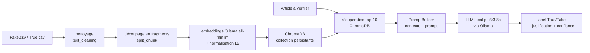

<h1 align="center">fake-news-detection</h1>

<p align="center">
  Système RAG local qui estime si un article de presse est fiable, en le comparant
  par similarité sémantique à une base d'articles déjà vérifiés (vrais / faux),
  puis en faisant trancher un LLM exécuté en local.
</p>

<p align="center">
  
  
  
  
</p>

<!-- [PAS ENCORE LIVRE] P1 :
<p align="center"></p>
-->

---

## Le problème

Face à un article douteux, une question simple : ressemble-t-il, sur le fond et le
ton, à des articles déjà établis comme vrais, ou à des articles déjà établis comme
faux ? Le formuler en système : indexer une base d'articles étiquetés, retrouver
les plus proches d'un texte soumis, et demander à un modèle de langage de conclure
en s'appuyant sur ces exemples.

## La solution

Une chaîne RAG (Retrieval-Augmented Generation) qui tourne **entièrement en local**
(confidentialité, pas d'API tierce) :

- **Chargement et nettoyage** : lecture de `data/Fake.csv` et `data/True.csv`,
  fusion, nettoyage du texte (HTML, URLs, ponctuation, casse) dans
  `data_handler/text_cleaning.py`.
- **Découpage** : `function_chunk/split_chunk.py` découpe chaque article en
  fragments à recouvrement (fenêtre glissante sur les mots).
- **Indexation** : `chroma/chroma_manager.py` calcule les embeddings via Ollama
  (`all-minilm`), les normalise (L2) et les insère par lots de 500 dans une
  collection ChromaDB persistante, avec les métadonnées (sujet, date, étiquette).
- **Récupération** : pour un texte soumis, `RAGSystem.analyze_article` interroge
  ChromaDB (`n_results=10`) pour les fragments les plus proches.
- **Prompt et décision** : `prompt/prompt_builder.py` construit un contexte à partir
  des fragments récupérés et un prompt de classification, envoyé au LLM local
  (`phi3:3.8b` via Ollama). La réponse attendue est `Label: "True"/"Fake"` +
  justification courte.
- **Post-traitement** : `prompt/rag_system.py` extrait l'étiquette par expression
  régulière et calcule un indicateur de confiance à partir de la cohérence entre le
  label prédit et les étiquettes des voisins récupérés.
- **Interfaces** : une CLI interactive (`main.py`, `questionary`) et un chat
  Streamlit (`app/app.py`).

## Architecture



```
fake-news-detection/
|- data_handler/     chargement CSV, nettoyage de texte
|- function_chunk/   découpage en fragments
|- chroma/           client (singleton), manager, requêtes
|- prompt/           PromptBuilder, RAGSystem
|- pipelines/        orchestration (Pipeline)
|- app/              interface Streamlit
|- tests/
|- main.py           CLI (flags -e / -i / -r)
\- pyproject.toml
```

## Stack technique

| Domaine | Outils |
|---|---|
| Base vectorielle | ChromaDB (client persistant) |
| Embeddings | Ollama `all-minilm` |
| LLM | Ollama `phi3:3.8b` (exécution locale) |
| Données | pandas, dataset Kaggle "Fake and real news" |
| CLI / UI | questionary, Streamlit |
| Packaging | `uv`, `pyproject.toml`, Docker |

## Installation

Prérequis : **Python 3.12+**, [`uv`](https://docs.astral.sh/uv/),
[Ollama](https://ollama.com/) en service.

```bash
git clone <url-du-repo> && cd fake-news-detection

ollama pull all-minilm:latest
ollama pull phi3:3.8b
ollama serve            # dans un terminal séparé

uv sync

python scripts/download_data.py   # [PAS ENCORE LIVRE] récupère Fake.csv / True.csv
```

Alternative conteneurisée : `docker compose up` [PAS ENCORE LIVRE] (app + Ollama +
modèle léger, pour une démo sans installation locale d'Ollama).

## Utilisation

```bash
# CLI
uv run main.py -e        # exploration des données
uv run main.py -i        # nettoyage, découpage, insertion dans ChromaDB
uv run main.py -r        # coller un article, obtenir label + justification

# Interface web
uv run python -m streamlit run app/app.py
```

## Résultats

**Aucune évaluation chiffrée n'est publiée pour l'instant.** [PAS ENCORE LIVRE]
L'indicateur de confiance actuel est heuristique (cohérence entre le label prédit et
les étiquettes des voisins). Une évaluation sur un échantillon hold-out étiqueté
(exactitude, matrice de confusion) sera versionnée dans `metrics/rag_eval.json`.
Aucun chiffre n'est avancé ici tant que ce fichier n'existe pas.

## Limites connues

- La démarche suppose que le sujet de l'article soumis est déjà représenté dans la
  base : un sujet totalement nouveau n'a pas de voisins pertinents.
- Découpage par mots (pas par tokens du modèle d'embedding ni par phrases).
- Dépendance forte à Ollama : embeddings et LLM en dépendent tous les deux.
- Dataset non redistribué dans le dépôt (récupération par script).

## Améliorations futures

- Évaluation quantitative sur hold-out ; remplacer l'indicateur de confiance
  heuristique par une métrique mesurée.
- Découpage par tokens ; comparaison de plusieurs tailles de fragment.
- Garde-fou "hors base" quand la distance au plus proche voisin dépasse un seuil.

## Ce que ce projet démontre

Conception d'une chaîne RAG de bout en bout (indexation, récupération, génération) ;
usage d'une base vectorielle (ChromaDB, embeddings, normalisation, insertion par
lots) ; exécution de LLM en local (Ollama) ; ingénierie de prompt à partir d'un
contexte récupéré.

## Licence

Distribué sous licence MIT. Voir le fichier [LICENSE](LICENSE).
